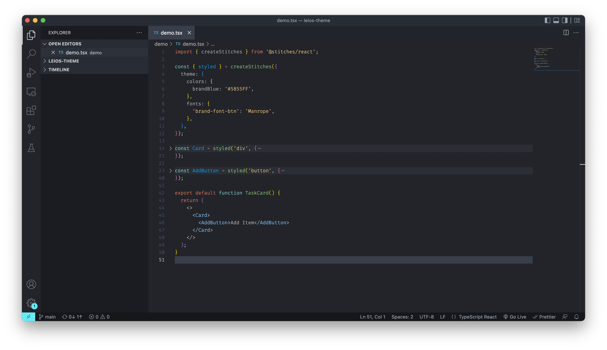
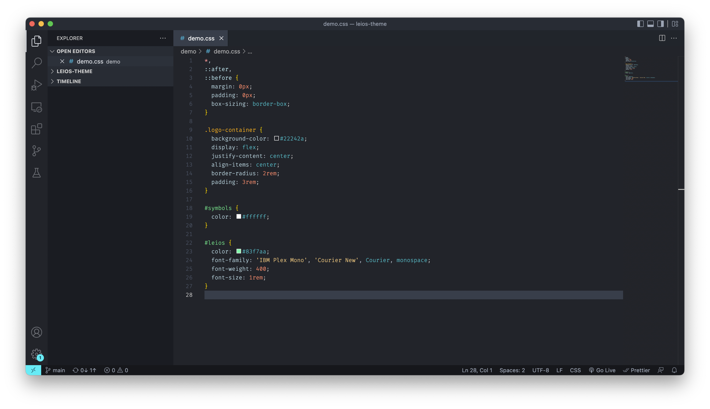

# Leios

A sleek VSCode theme inspired by One Monokai.

## Demo

### React

### CSS

Font used in demo screenshot is Fira Code, definitely worth checking out.

## Installation

1. Open **Extensions** in Visual Studio Code (`Cmd + Shift + X`).
2. Search for '**Leios**'.
3. Select the '**Leios**' theme by jahtomini.
4. Click the install button.
5. A selection box will show up, allowing you to choose your theme.
6. Select Leios and enjoy the view.

If the selection box does not show up, navigate to Settings (`Cmd + ,`) and type 'theme' in the input field. Select Leios as your color theme and enjoy.

## Other

Feel free to log an [issue](https://github.com/jahtomini/leios/issues) if there's a change you'll like made.
